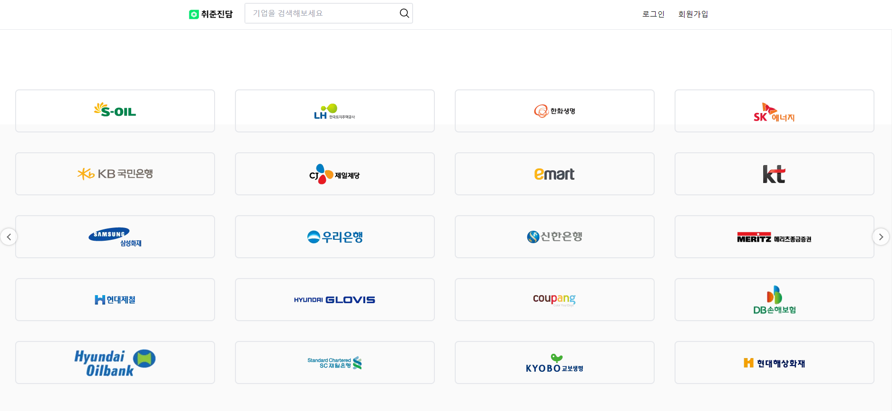
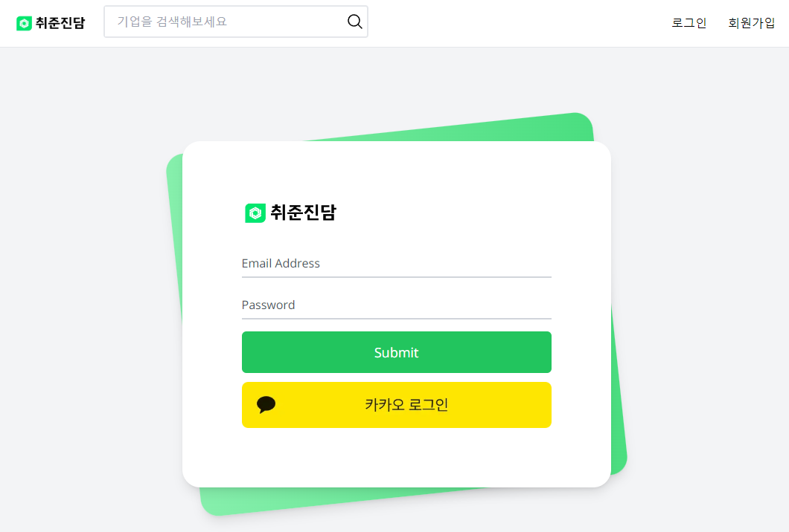
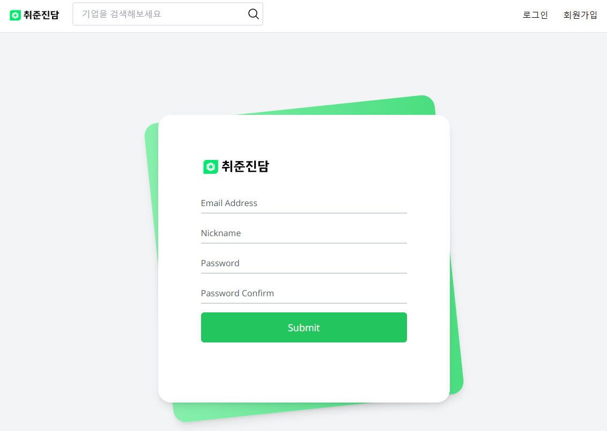
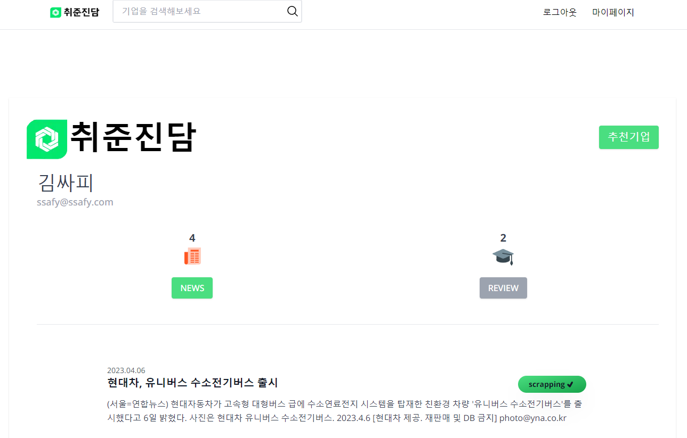
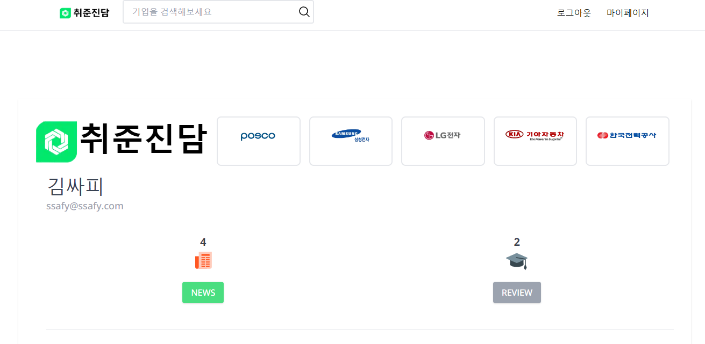
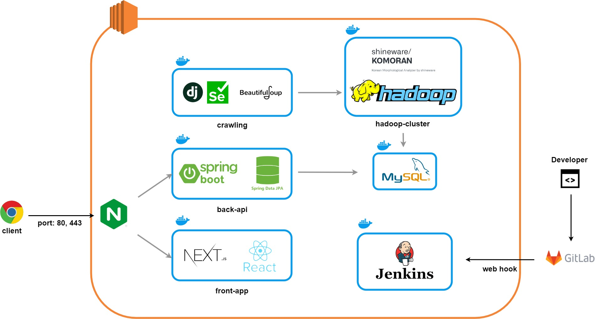
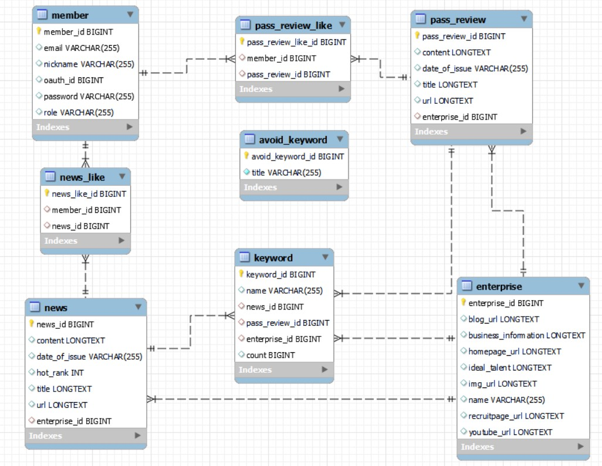

# 👨‍💼취준진담👩‍💼


## 프로젝트 소개
```
기업 별 뉴스 분석 및 합격 후기 모아보기를 제공하는 통합 정보 사이트 취준 진담.
선별된 100여개의 회사에 관련한 정보를 수집, 분석하여 제공합니다.
```
## 기획 배경
```
- 잡코리아 MZ세대 구직자 576명 대상 설문조사 결과 '취준생 84.5%, "취업 준비 시 정보 구하기 어려움 느낀다."'
- 자기소개서, 면접 준비 등 구직 활동을 위해 참고해야할 사이트가 너무 많고, 어떤 정보를 알아야하는지 어렵다. 이에 이를 개선할 수 있는 기업 정보 사이트를 구상하게 되었다.
```

## 서비스 기능
1. 기업 별 뉴스 분석 키워드 제공
2. 광고 없는 합격 후기 제공
3. 뉴스 및 합격 후기 스크랩 기능 제공
4. 스크랩한 기사의 키워드와 유사한 기업 추천 기능 제공

## 서비스 Overview
### 메인페이지


### 기업 정보 조회

### 기업 뉴스 조회

### 기업별 합격 후기

### 로그인 

### 회원가입

### 마이페이지 - 스크랩 모아보기

### 마이페이지 - 추천 기업 조회


## 기대효과 & 고도화 방안
- 취업 정보 수집에 대한 시간을 단축시켜 구직활동의 허들을 낮출 수 있다.
- 자소서 항목 분석을 통한 작성 가이드 기능 추가
- 커뮤니티 기능을 통한 정보 유동성 증대

## 기술 스택



## ERD


## 실행
자세한 배포 방법에 대한 내용은 [포팅매뉴얼](/exec/Readme.md) 참고
### Backend-api
``` bash
# 빌드
./gradlew build -x test

# 실행
java -jar build/libs/jobtalkbackend-0.0.1-SNAPSHOT.jar
```

### Frontend
``` bash
# 빌드
npm i
npm run build

# 실행
npm run start
```

### Backend-crawling
크롤링으로 수집된 데이터는 HDFS로 전송되어 분산 시스템의 Map-Reduce 단계를 거친뒤 DB에 저장됩니다. 따라서 crawling 서버는 데이터를 전송할 Hadoop Cluster 구축이 선행되어야합니다.
자세한 방법은 [Hadoop Cluster 구축 문서](docs/Hadoop/분산_Docker로_Hadoop_클러스터_구축하기_-_Hadoop_3.2.3.pdf)를 참조하세요.
``` bash
pip install -r requirements.txt
apt-get update && apt-get -y install sudo 
chmod +x /usr/src/app/dockerstart.sh
wget https://dl.google.com/linux/direct/google-chrome-stable_current_amd64.deb 
apt -y install ./google-chrome-stable_current_amd64.deb 
wget https://chromedriver.storage.googleapis.com/111.0.5563.64/chromedriver_linux64.zip
unzip chromedriver_linux64.zip

sudo echo '172.17.0.4        master1' >> /etc/hosts
sudo echo '172.17.0.5        worker1' >> /etc/hosts
sudo echo '172.17.0.6        worker2' >> /etc/hosts
python manage.py runserver --noreload
```


## 멤버
- 조승현 : Team Leader & Backend - API Server 개발   
- 정민지 : Backend - Crawling Server 개발   
- 홍예진 : DevOps - CI/CD 구축
    - Jenkins pipeline 구축
    - Dockerfile 작성
    - Hadoop Cluster 구축
    - 자연어 처리 모델 Komoran 적용
- 이재훈 : Frontend 개발   
- 조성욱 : Frontend 개발 
    - 프론트엔드 패키지 설계
    - 프론트엔드 UI/UX 설계  